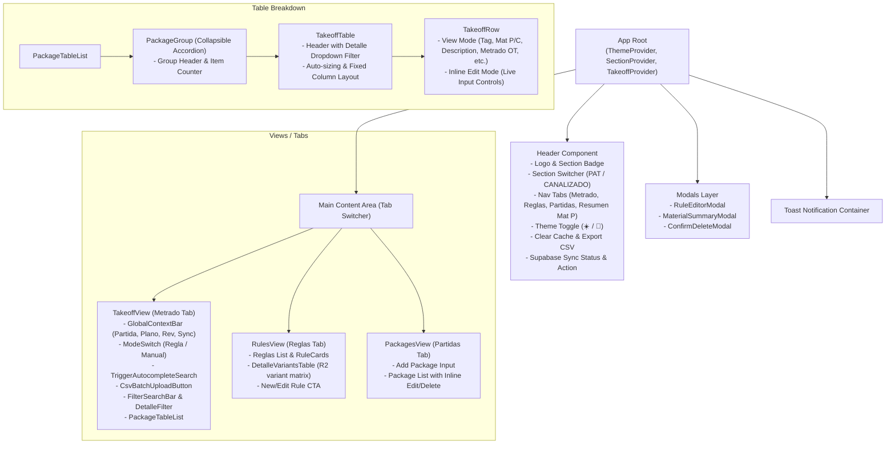
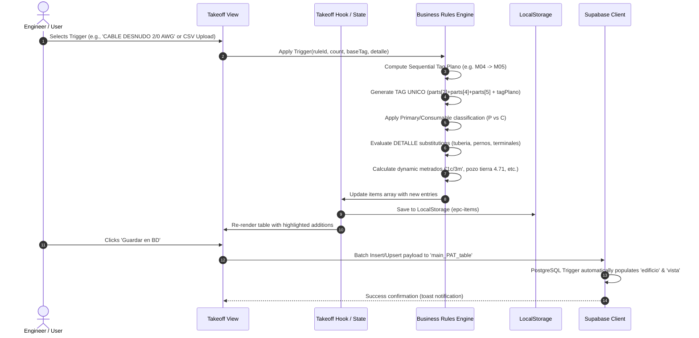

# Architecture Specification: EPC Takeoff (React + Vite + TypeScript + Supabase)

## 1. System Overview & Deployment Topology

The system transitions from an imperative single-file vanilla JavaScript approach to a modern, type-safe, reactive single-page application (SPA) built with **React 18/19**, **Vite**, and **TypeScript**, interacting directly with **Supabase (PostgreSQL)** and deployable as a static site on **Render** or **Vercel**.

```mermaid
flowchart TD
    subgraph Client ["Client Browser (SPA)"]
        UI["React 18/19 UI Components\n(Barlow Condensed & IBM Plex Mono)"]
        State["State Layer\n(React Context / Custom Hooks)"]
        Storage["Local Storage Cache\n(epc-items, epc-rules, epc-packages)"]
        SupaClient["Supabase JS Client (@supabase/supabase-js)\n(VITE_SUPABASE_URL, VITE_SUPABASE_KEY)"]
    end

    subgraph Hosting ["Hosting & CI/CD"]
        GitHub["GitHub Repository\n(Ntifragility/Project_EPC-Take_off)"]
        Render["Render / Vercel (Static Site)\nBuild: npm run build | Dir: dist"]
    end

    subgraph CloudBackend ["Supabase Cloud Backend"]
        DB[("PostgreSQL Database\n('main_PAT_table', 'planos_pat_spat')")]
        Triggers["DB Triggers & Functions\ntrg_fn_fill_main_PAT_table()"]
        Realtime["Realtime Broadcast & Subscriptions\n(WebSockets)"]
    end

    GitHub -->|Push to main / webhook| Render
    Render -->|Serves Static Bundle (HTML/JS/CSS)| UI
    UI <--> State
    State <--> Storage
    State <--> SupaClient
    SupaClient <-->|HTTPS REST API / Batch Upsert| DB
    SupaClient <-->|WSS Realtime Sync| Realtime
    DB --> Triggers
```

---

## 2. Component Architecture & Data Flow



---

## 3. Data Flow: Takeoff Rule Application & Calculations



---

## 4. TypeScript Domain Models

```typescript
// Core Data Models
export type MaterialType = 'P' | 'C';
export type SectionType = 'pat' | 'canalizado';
export type TabType = 'takeoff' | 'rules' | 'packages';

export interface TakeoffItem {
  id: string;             // Local UUID
  pkgId: string;          // Package / Partida ID
  material: MaterialType; // 'P' (Principal) or 'C' (Consumible)
  plano: string;          // e.g. P22-DA-2151-07-GL-001
  rev: string;            // e.g. 0, A, B
  tagUnico: string;       // Calculated: 2151GL001.M04 or with suffix .01
  tagPlano: string;       // e.g. M04
  detalle: string;        // e.g. 151, 020, 166C
  desc: string;           // Item description
  qty: number | string;   // Quantity for countable items
  metradoOt: string;      // Measurement or dynamic formula output
  unit: string;           // 'm', 'und', 'kg', 'm3'
  notes?: string;
  ruleId?: string;
}

export interface RuleSubitem {
  id: string;
  desc: string;
  qty: number | string;
  unit: string;
  ot?: number | string;
  otDynamic?: '1c/3m' | 'empty' | string;
}

export interface TakeoffRule {
  id: string;
  trigger: string;
  subitems: RuleSubitem[];
}

export interface PackageGroup {
  id: string;
  name: string;
}

export interface SupabaseTakeoffRecord {
  id?: string;
  material: string;
  plano: string;
  rev: string;
  tag_unico: string;
  tag_plano: string;
  detalle: string;
  description: string;
  qty: number | null;
  metrado_ot: string;
  unit: string;
  notes: string;
  pkg_name: string;
  edificio?: string;
  vista?: string;
  created_at?: string;
}
```

---

## 5. Folder Structure of the Restructured Frontend

```
frontend/
├── .env.example                     # VITE_SUPABASE_URL, VITE_SUPABASE_KEY
├── index.html                       # Vite HTML entry shell with fonts
├── package.json                     # React 18/19, TypeScript, Supabase, Vite
├── tsconfig.json                    # Strict TypeScript configuration
├── vite.config.ts                   # Vite configuration with React plugin
└── src/
    ├── main.tsx                     # Application entry point
    ├── App.tsx                      # Root orchestrator & tab routing
    ├── styles.css                   # Industrial Dark/Light CSS design system
    ├── lib/
    │   ├── supabase.ts              # Supabase Client initialization & health check
    │   └── storage.ts               # LocalStorage wrappers with fallback
    ├── types/
    │   └── takeoff.ts               # Domain TypeScript interfaces & types
    ├── data/
    │   ├── seedRules.ts             # PAT & Canalizado seed rules
    │   └── detalleVariants.ts       # Area Seca & Húmeda matrices for R2 & Tuberia
    ├── utils/
    │   ├── calculations.ts          # Formula parsers, tag sequencing, tagUnico generator
    │   ├── csvParser.ts             # CSV batch upload & regex mapper
    │   └── csvExporter.ts           # Clean UTF-8 CSV exporter with BOM
    ├── context/
    │   └── TakeoffContext.tsx       # Central reactive state & action dispatcher
    └── components/
        ├── Header.tsx               # Top bar, section switch, theme, DB sync button
        ├── Toast.tsx                # Non-blocking notification alerts
        ├── Takeoff/
        │   ├── TakeoffView.tsx      # Metrado main view container
        │   ├── AddPanel.tsx         # Global inputs, rule trigger & manual inputs
        │   ├── SearchBar.tsx        # Search, filters, undo button
        │   ├── PackageGroupView.tsx # Collapsible accordion for partidas
        │   ├── TakeoffTable.tsx     # Metrado table with fixed column sizing
        │   └── TakeoffRow.tsx       # Optimized row component with inline editing
        ├── Rules/
        │   ├── RulesView.tsx        # Rule catalogue & Detalle matrix table
        │   └── RuleEditorModal.tsx  # Add/edit rule modal dialog
        ├── Packages/
        │   └── PackagesView.tsx     # Partidas management view
        └── Modals/
            └── MaterialSummaryModal.tsx # Resumen Materiales P modal
```

---

## 6. Onrender & Supabase Deployment Pipeline

1. **Supabase Setup**:
   - Run `supabase_migration.sql` in Supabase SQL editor to ensure `main_PAT_table`, triggers, and `planos_pat_spat` are ready.
   - Obtain project URL (`https://xyz.supabase.co`) and public anonymous key (`anon key`).
2. **Local Environment**:
   - Configure `.env` in `frontend/`:
     ```env
     VITE_SUPABASE_URL=https://your-project.supabase.co
     VITE_SUPABASE_KEY=eyJhbGciOi...
     ```
3. **Onrender Configuration**:
   - Create a **Static Site** on Render linked to this GitHub repository.
   - Root Directory: `frontend`
   - Build Command: `npm install && npm run build`
   - Publish Directory: `dist`
   - Environment Variables on Render dashboard:
     - `VITE_SUPABASE_URL`
     - `VITE_SUPABASE_KEY`

